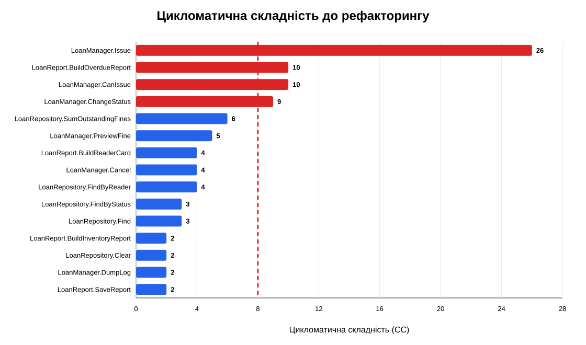

# Розділ 1. Інвентаризація та метрики до рефакторингу

## Вихідні дані

Варіант 2 — `LibraryDesk`. Модуль-донор — `LoanManager.Issue`,
розрахунковий вузол — строк видачі та пеня за прострочення. Джерело Б:
адаптований зріз власного проєкту. Це відхилення від умови про код з іншої
дисципліни потребує письмового погодження викладача.

Тег `baseline` позначає коміт `9e9e752`. На цьому коміті рішення збирається
командою `dotnet build LibraryDesk.Legacy.sln`: 0 помилок, 0 попереджень.

## Інвентарний опис

| Файл | Типи | Призначення | Публічних методів | Фіз. LOC | Лог. LOC |
|---|---|---|---:|---:|---:|
| `LegacyModels.cs` | `Reader`, `BookCopy`, `Loan`, `LoanResult` | Зберігає неінкапсульовані дані читача, примірника та видачі | 0 | 45 | 32 |
| `LoanManager.cs` | `LoanManager` | Оформлює видачу, строк, пеню та переходи стану | 6 | 283 | 143 |
| `LoanRepository.cs` | `LoanRepository` | Зберігає й шукає видачі та підсумовує пеню | 6 | 95 | 42 |
| `LoanReport.cs` | `LoanReport` | Формує звіти про прострочення, читачів і фонд | 4 | 86 | 44 |
| `Program.cs` | — | Запускає відтворюваний демонстраційний сценарій | 0 | 42 | 31 |
| **Разом** | **7 типів** | **5 файлів, 16 методів** | **16** | **551** | **292** |

Фізичний LOC включає порожні рядки, коментарі та рядки з дужками. Логічний
LOC виключає ці рядки. Різниця 259 рядків пояснюється вертикальним
форматуванням, дужками та коментарями; вона не використовується як оцінка
якості сама по собі.

## Методика

Скрипт `tools/measure_metrics.py` аналізує всі методи у `src/*.cs` однаково
до і після рефакторингу. LOC — непорожні рядки тіла без коментарів і окремих
дужок. CC починається з 1; по одиниці додають `if`, цикл, `case`, `catch`,
`&&`, `||`, `??`, `?.` і тернарний оператор. Вкладеність рахується від тіла
методу як рівня 1. Fan-out — кількість інших власних типів, згаданих класом.
Клони від шести рядків перевірено структурним порівнянням; `CL-01` — правило
пені у трьох класах.

## П'ятнадцять найгірших методів за CC

| Клас.метод | LOC | CC | Вклад. | Парам. | Fan-out | Клон |
|---|---:|---:|---:|---:|---:|---|
| `LoanManager.Issue` | 84 | 26 | 7 | 8 | 5 | — |
| `LoanReport.BuildOverdueReport` | 19 | 10 | 4 | 3 | 3 | CL-01 |
| `LoanManager.CanIssue` | 8 | 10 | 3 | 2 | 5 | — |
| `LoanManager.ChangeStatus` | 10 | 9 | 2 | 2 | 5 | — |
| `LoanRepository.SumOutstandingFines` | 12 | 6 | 4 | 1 | 2 | CL-01 |
| `LoanManager.PreviewFine` | 9 | 5 | 3 | 2 | 5 | CL-01 |
| `LoanReport.BuildReaderCard` | 8 | 4 | 2 | 2 | 3 | — |
| `LoanManager.Cancel` | 7 | 4 | 3 | 2 | 5 | — |
| `LoanRepository.FindByReader` | 5 | 4 | 3 | 1 | 2 | — |
| `LoanRepository.FindByStatus` | 5 | 3 | 2 | 1 | 2 | — |
| `LoanRepository.Find` | 4 | 3 | 2 | 1 | 2 | — |
| `LoanReport.BuildInventoryReport` | 6 | 2 | 2 | 1 | 3 | — |
| `LoanRepository.Clear` | 4 | 2 | 2 | 0 | 2 | — |
| `LoanManager.DumpLog` | 4 | 2 | 2 | 0 | 5 | — |
| `LoanReport.SaveReport` | 4 | 2 | 2 | 2 | 3 | — |

Повна таблиця з 16 методів міститься у `metrics-before.csv`. Максимальна
CC — 26, середня CC — 5,81, найдовший метод — 84 логічні рядки, максимальна
вкладеність — 7, максимальний fan-out — 5, знайдено один клон із трьома
входженнями.

**Рисунок 1 — Цикломатична складність методів до рефакторингу.**

## Межа прийнятності

Прийнятними вважаємо CC не більше 8, середню CC не більше 4, метод до 40
логічних рядків і вкладеність до 3. Метод із CC 26 має щонайменше 26
незалежних шляхів, тому його важко повно покрити тестами й безпечно змінити.
Пороги відповідають цільовим показникам завдання; перевищення означає
обов'язковий запис у плані рефакторингу або реєстрі технічного боргу.

