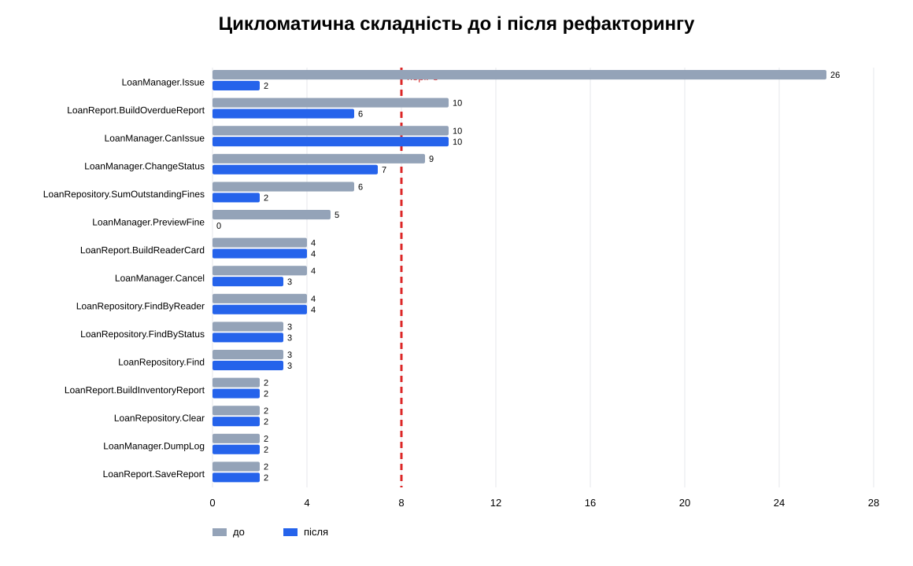

# Розділ 6. Повторне вимірювання і незмінність поведінки

## Порівняння метрик

Обидві таблиці отримано `tools/measure_metrics.py` за тією самою методикою.

| Метрика | До | Після | Зміна | Зміна, % |
|---|---:|---:|---:|---:|
| Логічний LOC у `src` | 292 | 326 | +34 | +11,64 % |
| Методів | 16 | 28 | +12 | +75,00 % |
| Максимальна CC | 26 | 10 | −16 | −61,54 % |
| Середня CC | 5,81 | 3,04 | −2,77 | −47,68 % |
| Найдовший метод, LOC | 84 | 15 | −69 | −82,14 % |
| Максимальна вкладеність | 7 | 3 | −4 | −57,14 % |
| Клонів від 6 рядків | 1 | 0 | −1 | −100 % |
| Максимальний fan-out | 5 | 11 | +6 | +120,00 % |
| Характеризаційних тестів | 0 | 13 | +13 | — |
| Рядкове покриття `LoanManager.cs` | 0 % | 74,41 % | +74,41 п.п. | — |

Максимальна CC лишилася 10 у допоміжному `CanIssue`, однак зниження від
початкового максимуму 26 становить 61,54 %, що перевищує дозволену
альтернативу 40 %. Середня CC нижча за 4, найдовший метод коротший за 40,
вкладеність не перевищує 3, а клонів немає.

LOC зріс на 11,64 % через окремі типи `IssueRequest`, `FineCalculator` та
переліки, а кількість методів — через названі етапи й явні сценарії замість
прапорців. Це очікуваний обмін рядків на зв'язність і читаність. Fan-out
`LoanManager` зріс до 11, бо вимірювач рахує нові типізовані enum, запит,
калькулятор і моделі як окремі власні типи. Цю ціну явних залежностей
зафіксовано як TD-03.

**Рисунок 2 — Цикломатична складність методів до і після рефакторингу.**
Зниклий `PreviewFine` показано значенням 0: його поведінку перенесено до
`FineCalculator.Calculate`.

## Три докази незмінності поведінки

1. **Історія тестів.** Після тегу `safety-net` тестовий файл змінювався лише
   у комітах R11, R12 і R19 разом зі зміною сигнатур. Числові очікування
   строків і пені не змінювалися; кількість тестів лишилася 13.
2. **Тести зелені на обох кінцях.** У тимчасовій робочій копії на тег
   `baseline` накладено каталог `Legacy.Tests` з тегу `safety-net`: Passed 13,
   Failed 0. На `after-refactoring`: Passed 13, Failed 0. Вихідний файл тестів
   компілюється на baseline завдяки сумісному reflection-шву.
3. **Однаковий сценарій.** `docs/out-before.txt` і `docs/out-after.txt`
   отримано однаковим запуском; `git diff --no-index` повертає код 0 і не
   виводить відмінностей.

